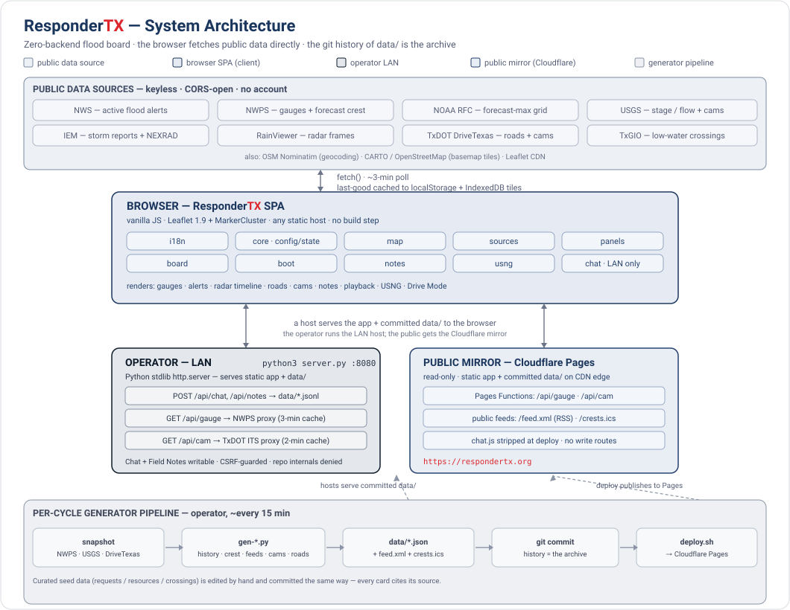
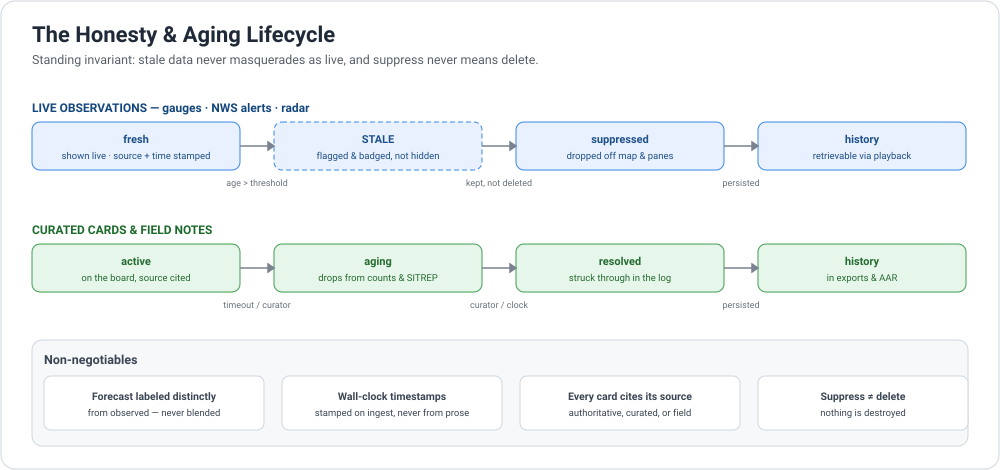

# Architecture

ResponderTX is a **zero-backend single-page app** at its core: vanilla JavaScript
and vendored Leaflet, no framework and no build step. The browser fetches public
data sources directly; hosting is a static file server. Two sanctioned server-side
departures exist, both opt-in and both dormant until someone turns them on: the
team-location relay and the device-alert registry, each a Cloudflare Durable
Object. This document maps the modules, the request flow, the two hosting modes,
and the generator pipeline.

## Client · the browser SPA

`index.html` loads a handful of focused, order-dependent scripts from `js/`. There
is no bundler; each file adds to a shared global `state` and `CONFIG` defined in
`core.js`.

| Module | Responsibility |
|--------|----------------|
| `core.js` | `APP_VERSION`, `CONFIG` (endpoints, poll interval, staleness thresholds, map center/bbox), global `state` |
| `i18n.js` | English / Spanish string tables and the `t()` translation helper |
| `usng.js` | WGS84 lat/lon &#8594; USNG/MGRS conversion (validated against the NGA `mgrs` library) |
| `map.js` | Leaflet map, themes, basemaps and panes, the unified radar timeline (observed &#8594; NOW &#8594; HRRR), rainfall (MRMS), layer sheet/pills, offline tiles |
| `playback.js` | Historical playback: archived gauge/road/warning replay, IEM archive tile faders, story captions, the `pbBlocksLive` lock; loads right after `map.js` |
| `sources.js` | Fetch + parse of NWS alerts, NWPS gauges/forecast, USGS, Local Storm Reports, DriveTexas roads, tropical, low-water crossings, tides |
| `cameras.js` | Camera networks (TxDOT, USGS HIVIS, city/county/port/border/coastal): markers, regional bucketing, inventory load, HLS/still viewer; loads right after `sources.js` |
| `panels.js` | Sidebar and lens rendering: forecast-to-flood list, gauges/roads tabs, alert list, hazard ticker + threat strip, and the docked Basin / Recovery / Crest-summary views behind `openView()` |
| `board.js` | Curated feed store (localStorage), smart sort, Nominatim search, JSON/GeoJSON/AAR/SITREP exports, device-alert subscription UI |
| `boot.js` | Cache save/hydrate, cold-start snapshot hydration, service-worker registration and update prompt, the init + poll loop; conditionally loads `chat.js` |
| `notes.js` | Field Notes flyout and map pins; merges `data/notes.json` with LAN posts |
| `chat.js` | **LAN-only** operator chat, loaded by `boot.js` only after `/api/ping` confirms the local host, and **stripped from the public deploy** |
| `team.js` | Opt-in live team location sharing: create/join, positions + breadcrumb trails, status, QR share; loads behind `?team=`, ships to the public mirror, talks to the team-relay Durable Object |
| `master.js` | **LAN-only** master oversight of all teams; loaded only when `/api/ping` reports `master:true`, and **stripped from the public deploy** |

Data flows one direction: fetch &#8594; normalize into `state` &#8594; render. Live
layers poll on `CONFIG.refreshMs` (~3 min). The last good payload is cached to
`localStorage`; basemap tiles can be pre-cached to `IndexedDB` for offline use. On a
cold start behind a rate-limit window, `boot.js` hydrates from the committed
`data/gauges-snapshot.json` so a fresh public visitor still sees gauges.

`sw.js` sits outside the module chain. It is an app-shell service worker with four
caches: a version-keyed static cache for the shell, plus version-independent caches
for last-good `data/` payloads, the playback archive under `history/`, and the
subscriber's language hint so a payload-free push can still be localized. It also
receives device alerts and self-heals a rotated push subscription on
`pushsubscriptionchange`. `SW_VERSION` must move with `APP_VERSION` and the
`index.html` stamps on every release; `cycle-check.sh` enforces that agreement.

## Hosting · two modes, one repo

The same committed repository is served two ways.

### Operator (LAN) · `server.py`

A small Python **stdlib** `http.server` (no dependencies) that serves the static
app and `data/`. When a TLS cert is present it serves **HTTPS on :8443** with a
plain-HTTP **:8080** listener that 301-redirects to it (the secure context unlocks
field geolocation); without a cert it falls back to plain HTTP on :8080. The TLS
handshake runs per-connection in a worker thread so a bad client cannot stall it.
Routes:

- `GET /api/ping`: capability beacon; the client loads chat/notes/master UI only if this answers (`master:true` when the admin token is configured).
- `GET /api/gauge/{lid}/{detail|series}`: NWPS hydrograph proxy with a 3-minute in-memory cache, so multi-viewer LANs do not hammer (and get rate-limited by) `api.water.noaa.gov`.
- `GET /api/cam/{net}/{id}`: camera-snapshot proxy (2-minute cache) that returns the raw JPEG, so the viewer never needs CORS. `{net}` is a TxDOT district or a city/county/port network key.
- `POST /api/chat`, `POST /api/notes`, `POST /api/requests`: append to `data/*.jsonl` (JSON-only content type, Origin/Host CSRF guard, size caps, coordinate validation).
- `GET /api/team/admin/{list,overview}`: token-gated proxy to the Cloudflare team registry for the LAN master view; the admin token is injected server-side, never in the browser.

Repo internals (`/.git`, `/.rdf`, `/.claude`) and operator inbox files are denied,
and `data/` + `api/` responses are `no-store`.

### Public mirror · Cloudflare Pages

A read-only copy on Cloudflare's CDN (<https://respondertx.org>). It serves the
same static app, the committed `data/` and `history/`, replicates the gauge and
camera proxies as **Pages Functions** (`functions/api/`), and publishes the follow
feeds `/feed.xml` and `/crests.ics`. `chat.js`, `master.js`, and the chat data are
stripped at deploy and the absence is verified.

Two opt-in write paths exist, each a Pages Function proxying a Durable Object that
ships from its own standalone Worker (a Pages project cannot define a DO):

| Path | Worker | Holds |
|------|--------|-------|
| `functions/api/team/*` | `workers/team-relay` (`TeamRelay`) | One DO per team: members, viewers, latest positions, capped breadcrumb trails. TTL'd, never written to the repo. |
| `functions/api/push/*` | `workers/push-alerts` (`PushRegistry`) | One DO for every anonymous push subscription: endpoint, browser-minted keys, alert prefs (types, alert area, followed gauges and places), language. Rows expire 60 days after the last renew; a 404/410 from a push service deletes the row. |

The push evaluator runs on a `*/5` Cron Trigger inside its Worker and is nudged by
`run-cycle.sh` right after each data deploy. It reads the **deployed** mirror's
`data/gauges-snapshot.json`, so an alert can never claim something the board itself
cannot show. Both Workers are `export-ignore`d and deploy separately from the Pages
archive.

## Generator pipeline · git history as the archive

Each cycle, the operator runs the generators in `scripts/`, which snapshot the live
sources and write committed artifacts. Because the snapshots are committed on a
regular cadence, the **git history of `data/` is the event archive**: historical
playback and the crest summary are reconstructed from it, not from a database.

Every 15 minutes (`8,23,38,53` on the system crontab, via `scripts/run-cycle.sh`):

| Script | Output | Purpose |
|--------|--------|---------|
| `fetch-snapshot.py` | `data/gauges-capture.json`, `data/gauges-snapshot.json` | One NWPS request at `captureBbox`, archived whole and filtered to `gaugeBbox` for display |
| `gen-roads-snapshot.py` | `data/roads-capture.json`, `data/roads-snapshot.json` | DriveTexas closure archive, same capture/display split |
| `gen-history.py` | `history/index.json` + `history/day/*.json`, `data/history.json`, `data/gauge-meta.json` | Playback frames from the committed snapshot history, plus a USGS/NWPS pre-event backfill |
| `gen-notices.py` | `data/requests.json` | LAN intake merge (never committed by the cycle) |
| `gen-shelters.py` | `data/shelters-live.json` | Live shelter status, published only where a source states one |
| `gen-crossings-status.py` | `data/crossing-status.json` | Jurisdiction-reported low-water-crossing status; only non-open rows publish |
| `gen-crest-summary.py` | `data/crest-summary.json` | Per-gauge event peak stages for after-action / FEMA review |
| `gen-feeds.py` | `feed.xml`, `crests.ics` | Public RSS + crest calendar |
| `gen-caltopo.py` | `data/caltopo-export.json` | CalTopo / SARTopo GeoJSON layer at a fixed URL |

Three generators run out of band because their inputs are near-static:
`gen-cameras.py` (the camera inventory), `gen-records.py` (the NWPS crest of record
per gauge), and `gen-river-sentry.py` (river-sentry tower positions).

The playback record publishes chunked: `history/index.json` carries the gauge and
road indexes plus one descriptor per UTC day, and each `history/day/*.json` is
content-hashed and immutable, so a client fetches only the days it lacks.
`data/history.json` remains as a bounded compatibility copy of the newest
`COMPAT_WINDOW_DAYS` of frames for clients that predate the chunk index.

`scripts/cycle-check.sh` is the pre-commit sanity bundle: eleven checks covering
JSON validity, `node --check` on `js/*.js`, version agreement across `js/core.js`,
the `index.html` stamps, `sw.js`, `data/changelog.json` and `CHANGELOG.md`, feed
freshness, snapshot sanity, the staged-file guard, 911-gate Escape immunity, the
event-config brand hook, chat-cursor monotonicity, the data-contract schemas, and
the 911 footer on every lens. It runs two lanes: the data lane always validates the
working tree the cycle is about to commit, while the code lane can read `HEAD`
(`--code-from-head`) so a release agent's half-finished version bump cannot fail a
data cycle. `scripts/deploy.sh` re-verifies version agreement, builds a stripped
archive from `HEAD` (removing the LAN-only `chat.js` and `master.js`), confirms no
chat references survive at the origin, and publishes to Cloudflare Pages.

## Honesty & aging

The aging discipline is an architectural invariant, not a feature toggle. Every
layer has a staleness threshold, auto-suppression, and a retrievable history view.
See the lifecycle diagram and rules in the README:

## Configuration

- `data/event.json`: per-event identity and geography (name, region, map
  center/zoom, sub-area presets, tide stations, `captureBbox` for what the pipeline
  collects, `gaugeBbox` for what the board displays, `archiveStart` for how far back
  reconstruction may reach). The generators read it from the working tree, but
  `deploy.sh` ships `git archive HEAD`, so an **uncommitted** edit re-targets the
  pipeline while the client keeps the old map centre, AO presets, USGS tiling box
  and tide stations. That is a split brain, not a re-target: commit it.
- `CONFIG` in `js/core.js`: endpoints, poll interval, LSR window, staleness
  thresholds, playback ranges.

---

> Copyright (C) 2026 R-fx Networks &lt;proj@rfxn.com&gt; &#183; Ryan MacDonald &#183; Licensed under GNU GPL v2
