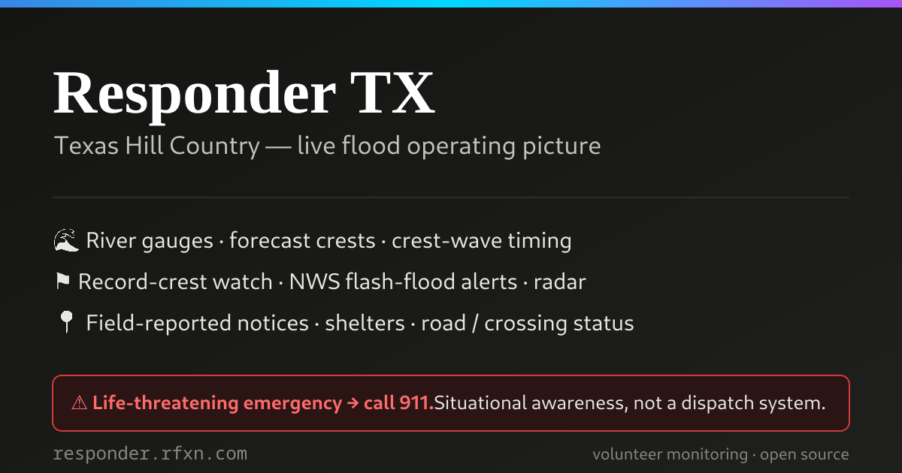
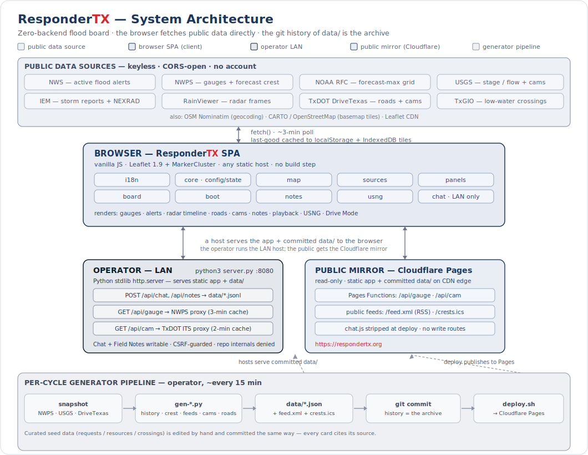
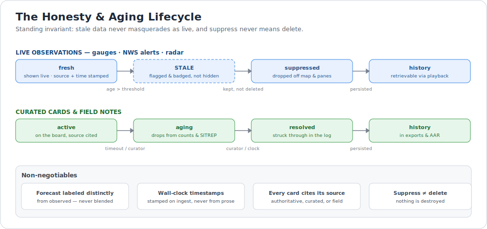

<p align="center">
  <picture>
    <source media="(prefers-color-scheme: dark)" srcset="assets/brand/logo-horizontal-dark.png">
    <source media="(prefers-color-scheme: light)" srcset="assets/brand/logo-horizontal.png">
    
  </picture>
</p>

<p align="center"><strong>Live Hazard Awareness for Texas</strong></p>

<p align="center">
  <a href="https://respondertx.org"></a>
  <a href="https://www.gnu.org/licenses/old-licenses/gpl-2.0.html"></a>
  
  
  
</p>

ResponderTX delivers a real-time, source-cited picture of hazards, roads, weather,
and field conditions across Texas. Built for responders and open to the public, it
combines official data, ground truth, cameras, forecasts, and reports into one
honest, easy-to-use view, so everyone can make safer, faster decisions. Calm,
capable, and honest about uncertainty: every card names its source, and nothing
stale is ever shown as live.

<p align="center">
  Live data from trusted sources &#183; Roads &amp; flood conditions &#183; Weather
  intelligence &#183; Cameras &amp; sensors &#183; Field reports &amp; updates &#183;
  Built for responders, open to all
</p>

A live, zero-backend web board that fuses a single flood operating picture for the
Texas Hill Country: river gauges with **forecast** crests, crest-wave timing,
record-crest watch, NWS flash-flood alerts, a unified observed-to-forecast radar
timeline, road and low-water-crossing status, and a human-triaged field feed —
built for a first responder working from a truck, and for anyone watching the
public mirror.

> Copyright (C) 2026 [R-fx Networks](https://www.rfxn.com) &lt;proj@rfxn.com&gt; &#183; Ryan MacDonald &#183; Licensed under [GNU GPL v2](https://www.gnu.org/licenses/old-licenses/gpl-2.0.html)

> [!WARNING]
> **Life-threatening emergency? Call 911.** ResponderTX is situational awareness and
> volunteer-coordination support. It is **not** a dispatch system, it is **not** an
> official warning source, and it is not monitored by emergency services. Always
> verify with the National Weather Service, Wireless Emergency Alerts, and 911. Do
> not self-deploy into warned areas. See [ABOUT.md](ABOUT.md).

**Live board:** <https://respondertx.org> &#183; **Follow:** [RSS](https://respondertx.org/feed.xml) &#183; [crest calendar (ICS)](https://respondertx.org/crests.ics)

<p align="center"></p>

---

## Contents

- [Why it exists](#why-it-exists)
- [Feature highlights](#feature-highlights)
- [Data sources](#data-sources)
- [Architecture](#architecture)
- [Honesty & aging discipline](#honesty--aging-discipline)
- [Deployment model](#deployment-model)
- [Quick start](#quick-start)
- [Configuration](#configuration)
- [Privacy](#privacy)
- [Project docs](#project-docs)
- [Safety & scope](#safety--scope)
- [License](#license)
- [Support](#support)

---

## Why it exists

In a flash flood, the decision a responder needs is *"where do I go and what do I
expect"* — in under ten seconds, gloved, glare-lit, and intermittently connected.
Most public flood pages answer that slowly: they mix observed and forecast water
without saying which is which, they let a stale reading sit on the map as if it
were live, and they need an account or bury the map under a login.

ResponderTX takes the opposite stance. It **anticipates** (forecast-first: every
major crest this event showed up in the forecast field hours before the water
arrived), it is **recent** (everything ages — nothing stale is shown as live), and
it is **honest** (every card cites its source; suppress never means delete). Its
core runs with **zero backend** from any static host, so it stays up when
infrastructure does not, and it asks nothing of the person reading it: no account,
no tracking. The one sanctioned exception is the opt-in team-location relay, a
Cloudflare Durable Object that stays dormant unless someone joins a team.

## Feature highlights

**Anticipation (forecast-first)**
- River gauges with both **observed** and **forecast** flood category, rising (&#9650;) markers, and a 48-hour stage sparkline against action/minor/moderate/major flood stages
- "Forecast to flood" pre-positioning list, soonest crest first — the board's highest-value pane
- Crest-wave timing as the flood moves downstream, plus a record-crest watch
- Unified radar timeline in one scrubber: **observed past &#8594; NOW &#8594; HRRR model future**, with A/B buffered playback

**Ground truth**
- NWS active flood alerts with flash-flood-emergency detection
- Local Storm Reports from trained spotters and officials, road mentions highlighted
- Road closures and low-water crossings; TxDOT and USGS river cameras
- Historical playback — replay the event over 3 / 7 / 14 days from committed snapshots

**Field workflow**
- THREAT-TO-LIFE strip: live fused counts (emergencies, cut-off areas, major gauges, roads blocked) — tap a chip to focus it
- Smart-sorted feed (urgency &#215; freshness) with freshness dots, re-verify flags, and NEW-since-last-visit chips
- Drive Mode (big-type nearest-hazards glance list), USNG/MGRS coordinates, "Am I at risk?" address check
- Search by place, address, gauge, lat/lon, or card ID
- Handoff: export JSON (merge by id), **GeoJSON** (drops into CalTopo / SARTopo), Markdown AAR, and a plain-text SITREP for radio/SMS
- Field Notes: responder annotations (writable on the LAN host, read-only on the public mirror)

**Team coordination (opt-in)**
- Create a private team as SAR, Response, Recovery, or Community Support, each with its own member roles; share a link and QR to bring people in
- Live member positions with capped breadcrumb trails, status (in-field / standby / unavailable), and last-seen aging; ephemeral handles, no login, private by default
- LAN master view for multi-team oversight; the relay is a TTL'd Cloudflare Durable Object, never written to the git archive

**Built to stay up**
- Public RSS feed and an ICS crest calendar — follow without an app
- Deep-linkable, shareable views (`?tab=alerts`, `?theme=light`, map position preserved)
- "Save map offline" pre-caches basemap tiles to IndexedDB for canyon dead zones
- Bilingual UI (English / Spanish)

## Data sources

Every live layer is a **keyless, CORS-open** public endpoint, so the board runs
from any static host with no server of its own. Each card names its provenance.

| Data | Provider | Host / API |
|------|----------|------------|
| Active flood alerts, flash-flood-emergency detection | [National Weather Service](https://www.weather.gov/documentation/services-web-api) | `api.weather.gov` |
| River gauges: observed + forecast flood category, stage history | [NOAA National Water Prediction Service (NWPS)](https://water.noaa.gov/) | `api.water.noaa.gov` |
| Forecast-max grid (crest rings) | [NOAA River Forecast Centers](https://water.noaa.gov/) | `maps.water.noaa.gov` |
| Stage / streamflow instantaneous values, HIVIS river cameras | [U.S. Geological Survey](https://waterservices.usgs.gov/) | `waterservices.usgs.gov`, `api.waterdata.usgs.gov` |
| Local Storm Reports, NEXRAD composite radar tiles | [Iowa Environmental Mesonet (Iowa State University)](https://mesonet.agron.iastate.edu/) | `mesonet.agron.iastate.edu` |
| Radar frame timeline (observed past) | [RainViewer](https://www.rainviewer.com/api.html) | `api.rainviewer.com` |
| Road closures + traffic cameras | [TxDOT DriveTexas](https://drivetexas.org/) | `services5.arcgis.com`, `its.txdot.gov` |
| Low-water crossings | [Texas Geographic Information Office (TxGIO)](https://geographic.texas.gov/) | `feature.geographic.texas.gov` |
| Address / place geocoding | [OpenStreetMap Nominatim](https://nominatim.org/) | `nominatim.openstreetmap.org` |
| Basemap tiles | [CARTO](https://carto.com/basemaps/) &#183; [OpenStreetMap](https://www.openstreetmap.org/copyright) | `basemaps.cartocdn.com`, `tile.openstreetmap.org` |
| Map engine | [Leaflet](https://leafletjs.com/) | CDN (unpkg) |

Curated seed data — assistance requests, resources/shelters/hotlines, and known
crossings in `data/*.json` — is edited by hand and cites its source; everything
else in the table is live.

## Architecture

ResponderTX is a vanilla-JavaScript single-page app (no framework, no build step)
that draws a Leaflet map and fetches the public sources above **directly from the
browser**. The operator runs a small Python LAN host (`server.py`) for chat, field
notes, and cached gauge/camera proxies; the public gets a **read-only Cloudflare
Pages mirror** of the same committed repo. A per-cycle generator pipeline snapshots
the live sources, writes `data/*.json` plus the feeds, and commits them — so the
**git history of `data/` is the event archive** that powers historical playback.

<p align="center"></p>

The browser SPA is split into focused modules: `core` (config/state), `map`,
`sources`, `panels`, `board`, `boot`, `notes`, `i18n`, `usng`, `team` (opt-in live
team sharing), and the LAN-only `chat` and `master` (both stripped from the public
deploy). See [ARCHITECTURE.md](ARCHITECTURE.md)
for the module map, request flow, and the public-mirror strip contract.

## Honesty & aging discipline

The defining invariant: **stale data never masquerades as live, and suppress never
means delete.** Every layer ships with a default timeout, auto-suppression off the
map and panes, and a retrievable history view. Observations that go stale are
flagged and badged, not silently hidden; forecast is always labeled distinctly from
observed; timestamps come from the wall clock, never from prose.

<p align="center"></p>

## Deployment model

| | Operator (LAN) | Public mirror |
|---|---|---|
| Host | `python3 server.py` on the local network | Cloudflare Pages (global CDN) |
| Serves | static app + committed `data/` | static app + committed `data/` |
| Writes | chat + Field Notes &#8594; `data/*.jsonl` | board data read-only; the opt-in team relay (`/api/team/*` &#8594; Cloudflare Durable Object) is the one write path |
| Proxies | `/api/gauge` (NWPS), `/api/cam` (TxDOT), team relay, cached | same, as Pages Functions |
| Chat | present | `chat.js` + `master.js` stripped at deploy, verified |
| Feeds | — | `/feed.xml` (RSS), `/crests.ics` |

The generator pipeline (`scripts/gen-*.py`) runs each cycle on the operator host:
it snapshots NWPS / USGS / DriveTexas into `data/`, builds `history.json`,
`crest-summary.json`, `feed.xml`, `crests.ics`, and the camera/road snapshots, and
those files are committed. `scripts/deploy.sh` then verifies version agreement,
strips the LAN-only chat, and publishes to Cloudflare Pages.

## Quick start

No build, no dependencies beyond Python 3 — clone and serve:

```bash
git clone https://github.com/rfxn/responder-tx.git
cd responder-tx
python3 server.py          # LAN host: HTTPS :8443 + an :8080 HTTP->HTTPS redirect when a TLS cert exists, else plain HTTP :8080 (chat / notes / gauge + cam proxy). See scripts/README.md "LAN HTTPS".
# open https://localhost:8443  (http://localhost:8080 redirects there)   deep links: ?tab=alerts  ·  ?theme=light
```

The board needs internet at runtime for the Leaflet CDN, basemap tiles, and the
federal / state APIs above. The &#8681; "Save map offline" control pre-caches
basemap tiles to IndexedDB (no service worker) so the map keeps
drawing in dead zones — basemap only; live data still needs a connection.

For a purely public, read-only view you do not need to run anything — just open the
[live board](https://respondertx.org).

## Configuration

Per-event settings live in `data/event.json` (name, subtitle, map center/zoom,
gauge bounding box) — swap that file to re-point the board at a new event, no code
change. Remaining knobs (poll interval, LSR window, stale thresholds, playback
window) are in `CONFIG` at the top of `js/core.js`. Flood-category colors follow
the NWS AHPS convention, always paired with text labels and size-stepped markers.

## Privacy

No accounts. No analytics, no third-party trackers, no advertising cookies. Your
view state (theme, language, last-seen markers, cached last-good data) is kept in
your own browser via `localStorage` and `IndexedDB` and is never sent anywhere. The
public mirror has no chat and no board-data write routes; the only server-write path
is the opt-in team-location relay (dormant unless you join a team via `?team=`),
which holds ephemeral, TTL'd state in Cloudflare and is never written to the git
archive. See [ABOUT.md](ABOUT.md#privacy).

## Project docs

- [ABOUT.md](ABOUT.md) — who runs it, what it is and is not, methodology, provenance, privacy
- [ARCHITECTURE.md](ARCHITECTURE.md) — modules, request flow, hosting split, generator pipeline
- [CONTRIBUTING.md](CONTRIBUTING.md) — how to report issues and contribute
- [STRATEGY.md](STRATEGY.md) — social-signal and data strategy, triage rubric, operating workflow
- [ROADMAP.md](ROADMAP.md) — product thesis, invariants, and release plan
- [CHANGELOG.md](CHANGELOG.md) — release history

## Safety & scope

ResponderTX is a situational-awareness aid, not an authority. It does not replace
official warnings, evacuation orders, or 911. Data can be delayed, incomplete, or
wrong; sensors freeze, feeds lag, and curated entries can go stale — the board
labels these conditions but cannot eliminate them. **Life-threatening emergency?
Call 911.** Verify with the National Weather Service and Wireless Emergency Alerts.
Never self-deploy into a warned area; volunteer offers route to vetted response
organizations, not to individuals.

The current build is scoped to the July 2026 Texas Hill Country flood. The board is
event-configurable (`data/event.json`) and the data pipeline is Texas-specific only
where the sources are (TxDOT, TxGIO); the core — gauges, NWS alerts, radar, honesty
discipline — generalizes to any U.S. flood.

## License

ResponderTX is distributed under the **GNU General Public License v2**. Developed
and maintained by Ryan MacDonald &lt;ryan@rfxn.com&gt; for
[R-fx Networks](https://www.rfxn.com). Credit must be given for derivative works as
required under the GNU GPL.

## Support

- **Source & issues:** <https://github.com/rfxn/responder-tx>
- **Email:** proj@rfxn.com

Bugs, corrections, and new data sources are welcome as GitHub issues.
