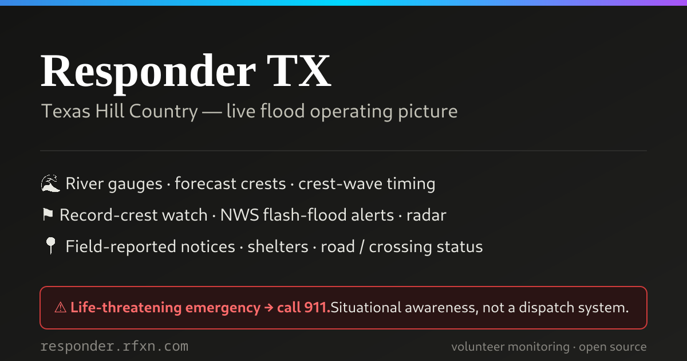

<p align="center">
  <picture>
    <source media="(prefers-color-scheme: dark)" srcset="assets/brand/logo-horizontal-dark.png">
    <source media="(prefers-color-scheme: light)" srcset="assets/brand/logo-horizontal.png">
    
  </picture>
</p>

<p align="center"><strong>Live Hazard Awareness for Texas</strong></p>

<p align="center">
  <a href="https://respondertx.org"></a>
  <a href="https://www.gnu.org/licenses/old-licenses/gpl-2.0.html"></a>
  
  
  
</p>

ResponderTX delivers a real-time, source-cited picture of hazards, roads, weather,
and field conditions across Texas. Built for responders and open to the public, it
combines official data, ground truth, cameras, forecasts, and reports into one
honest, easy-to-use view, so everyone can make safer, faster decisions. Calm,
capable, and honest about uncertainty: every card names its source, and nothing
stale is ever shown as live.

<p align="center">
  Live data from trusted sources &#183; Roads &amp; flood conditions &#183; Weather
  intelligence &#183; Cameras &amp; sensors &#183; Field reports &amp; updates &#183;
  Built for responders, open to all
</p>

A live, zero-backend web board that fuses a single flood operating picture for
Texas: river gauges with **forecast** crests, crest-wave timing, record-crest
watch, NWS flash-flood alerts, a unified observed-to-forecast radar timeline, road
and low-water-crossing status, a statewide camera network, and a human-triaged
field feed. Built for a first responder working from a truck, and for anyone
watching the public mirror.

> Copyright (C) 2026 [R-fx Networks](https://www.rfxn.com) &lt;proj@rfxn.com&gt; &#183; Ryan MacDonald &#183; Licensed under [GNU GPL v2](https://www.gnu.org/licenses/old-licenses/gpl-2.0.html)

> [!WARNING]
> **Life-threatening emergency? Call 911.** ResponderTX is situational awareness and
> volunteer-coordination support. It is **not** a dispatch system, it is **not** an
> official warning source, and it is not monitored by emergency services. Always
> verify with the National Weather Service, Wireless Emergency Alerts, and 911. Do
> not self-deploy into warned areas. See [ABOUT.md](ABOUT.md).

**Live board:** <https://respondertx.org> &#183; **Follow:** [RSS](https://respondertx.org/feed.xml) &#183; [crest calendar (ICS)](https://respondertx.org/crests.ics)

<p align="center"></p>

---

## Contents

- [Why it exists](#why-it-exists)
- [Feature highlights](#feature-highlights)
- [Data sources](#data-sources)
- [Architecture](#architecture)
- [Honesty & aging discipline](#honesty--aging-discipline)
- [Deployment model](#deployment-model)
- [Quick start](#quick-start)
- [Configuration](#configuration)
- [Privacy](#privacy)
- [Project docs](#project-docs)
- [Safety & scope](#safety--scope)
- [License](#license)
- [Support](#support)

---

## Why it exists

In a flash flood, the decision a responder needs is *"where do I go and what do I
expect"*, in under ten seconds, gloved, glare-lit, and intermittently connected.
Most public flood pages answer that slowly: they mix observed and forecast water
without saying which is which, they let a stale reading sit on the map as if it
were live, and they need an account or bury the map under a login.

ResponderTX takes the opposite stance. It **anticipates** (forecast-first: every
major crest this event showed up in the forecast field hours before the water
arrived), it is **recent** (everything ages, and nothing stale is shown as live), and
it is **honest** (every card cites its source; suppress never means delete). Its
core runs with **zero backend** from any static host, so it stays up when
infrastructure does not, and it asks nothing of the person reading it: no account,
no tracking. The one sanctioned exception is the opt-in team-location relay, a
Cloudflare Durable Object that stays dormant unless someone joins a team.

## Feature highlights

**Anticipation (forecast-first)**
- River gauges with both **observed** and **forecast** flood category, rising (&#9650;) markers, and a 48-hour stage sparkline against action/minor/moderate/major flood stages
- "Forecast to flood" pre-positioning list, soonest crest first, the board's highest-value pane
- Crest-wave timing as the flood moves downstream, plus a record-crest watch against the NWPS crest of record
- Unified radar timeline in one scrubber: **observed past &#8594; NOW &#8594; HRRR model future**, with A/B buffered playback
- Basin Focus: a single-river corridor view that walks one basin gauge by gauge with the crest wave on it

**Ground truth**
- NWS active flood alerts with flash-flood-emergency detection
- Local Storm Reports from trained spotters and officials, road mentions highlighted
- Road closures, plus live low-water-crossing status where a jurisdiction reports one
- A statewide camera fleet (thousands of traffic, flood, river, coastal, port and border cameras), bucketed by region and network, with still and live feeds shown distinctly
- Historical playback over 3 / 7 / 14 / 30 / 90 days from an immutable committed archive, marked honestly where the range runs deeper than the archive

**Field workflow**
- THREAT-TO-LIFE strip: live fused counts (emergencies, cut-off areas, major gauges, roads blocked), tap a chip to focus it, with a scrolling hazard ticker above it
- Smart-sorted feed (urgency &#215; freshness) with freshness dots, re-verify flags, and NEW-since-last-visit chips
- Drive Mode (big-type nearest-hazards glance list), USNG/MGRS coordinates, "Am I at risk?" address check
- Search by place, address, gauge, lat/lon, or card ID
- Handoff: export JSON (merge by id), **GeoJSON** (drops into CalTopo / SARTopo), Markdown AAR, and a plain-text SITREP for radio/SMS
- A ready-made CalTopo / SARTopo layer at a fixed URL, refreshed each cycle, importable by link or QR
- Notify me (opt-in device alerts): a notification for new Flash Flood Emergencies, for an area-wide gauge tier, and for specific gauges you follow, in English or Spanish. Set up from the Alerts tab, the Settings gear, or any gauge popup
- Field Notes: responder annotations (writable on the LAN host, read-only on the public mirror)

**Team coordination (opt-in)**
- Create a private team as SAR, Response, Recovery, or Community Support, each with its own member roles; share a link and QR to bring people in
- Live member positions with capped breadcrumb trails, status (in-field / standby / unavailable), and last-seen aging; ephemeral handles, no login, private by default
- LAN master view for multi-team oversight; the relay is a TTL'd Cloudflare Durable Object, never written to the git archive

**Built to stay up**
- Public RSS feed and an ICS crest calendar, so you can follow without an app
- Deep-linkable, shareable views (`?tab=alerts`, `?theme=light`, `?view=basin`, map position preserved)
- A service worker caches the app shell, the last-good data payloads, and the playback archive, so the board still opens and still replays with no signal
- "Save map offline" pre-caches basemap tiles to IndexedDB for canyon dead zones
- Bilingual UI (English / Spanish)

## Data sources

Every live hazard layer is a **keyless, CORS-open** public endpoint, so the board
runs from any static host with no server of its own. Camera stills are the one
exception: they are fetched through a same-origin `/api/cam` proxy (a Pages
Function on the mirror, a `server.py` route on the LAN host) because the source
imagery is not CORS-open. Each card names its provenance.

| Data | Provider | Host / API |
|------|----------|------------|
| Active flood alerts, flash-flood-emergency detection | [National Weather Service](https://www.weather.gov/documentation/services-web-api) | `api.weather.gov` |
| River gauges: observed + forecast flood category, stage history | [NOAA National Water Prediction Service (NWPS)](https://water.noaa.gov/) | `api.water.noaa.gov` |
| Forecast-max grid (crest rings) | [NOAA River Forecast Centers](https://water.noaa.gov/) | `maps.water.noaa.gov` |
| Stage / streamflow instantaneous values, HIVIS river cameras | [U.S. Geological Survey](https://waterservices.usgs.gov/) | `waterservices.usgs.gov`, `api.waterdata.usgs.gov` |
| Local Storm Reports, NEXRAD composite + HRRR + MRMS rainfall tiles | [Iowa Environmental Mesonet (Iowa State University)](https://mesonet.agron.iastate.edu/) | `mesonet.agron.iastate.edu` |
| Radar frame timeline (observed past) | [RainViewer](https://www.rainviewer.com/api.html) | `api.rainviewer.com` |
| Active tropical cyclones, storm-surge hazard maps | [NOAA National Hurricane Center](https://www.nhc.noaa.gov/) via Esri Living Atlas | `services9.arcgis.com`, `tiles.arcgis.com` |
| Coastal water level vs prediction (surge residual) | [NOAA CO-OPS Tides &amp; Currents](https://tidesandcurrents.noaa.gov/) | `api.tidesandcurrents.noaa.gov` |
| Road closures + traffic cameras | [TxDOT DriveTexas](https://drivetexas.org/) | `services5.arcgis.com`, `its.txdot.gov` |
| Low-water crossing locations | [Texas Geographic Information Office (TxGIO)](https://geographic.texas.gov/) | `feature.geographic.texas.gov` |
| Low-water crossing status, Austin-area flood cameras | [ATX Floods](https://atxfloods.com/) (Beholder Technology, LLC) | `atxfloods.com` |
| City, county, port, border and coastal cameras | Houston TranStar, City of Austin, City of Arlington, City of Lubbock, City of Corpus Christi, City of El Paso, City of Laredo, City of Eagle Pass, City of Del Rio, Hays County OES, Port Houston, Port of Galveston, Saltwater Recon, WeatherBug, New Mexico DOT, National Park Service | stills via the same-origin `/api/cam` proxy; live feeds play direct from the operator |
| Address / place geocoding | [OpenStreetMap Nominatim](https://nominatim.org/) | `nominatim.openstreetmap.org` |
| Basemap tiles | [CARTO](https://carto.com/basemaps/) &#183; [OpenStreetMap](https://www.openstreetmap.org/copyright) | `basemaps.cartocdn.com`, `tile.openstreetmap.org` |
| Map engine | [Leaflet](https://leafletjs.com/) + MarkerCluster | vendored in `js/vendor/`, no CDN |

Curated seed data (assistance requests, resources/shelters/hotlines, and known
crossings in `data/*.json`) is edited by hand and cites its source; everything
else in the table is live.

## Architecture

ResponderTX is a vanilla-JavaScript single-page app (no framework, no build step)
that draws a Leaflet map and fetches the public sources above **directly from the
browser**. The operator runs a small Python LAN host (`server.py`) for chat, field
notes, and cached gauge/camera proxies; the public gets a **read-only Cloudflare
Pages mirror** of the same committed repo. A per-cycle generator pipeline snapshots
the live sources, writes `data/*.json` plus the feeds, and commits them, so the
**git history of `data/` is the event archive** that powers historical playback.

<p align="center"></p>

The browser SPA is split into focused modules: `core` (config/state), `map`,
`playback`, `sources`, `cameras`, `panels`, `board`, `boot`, `notes`, `i18n`,
`usng`, `team` (opt-in live team sharing), and the LAN-only `chat` and `master`
(both stripped from the public deploy). A service worker (`sw.js`) caches the app
shell, the last-good data payloads and the playback archive, and receives device
alerts. See [ARCHITECTURE.md](ARCHITECTURE.md) for the module map, request flow,
and the public-mirror strip contract.

## Honesty & aging discipline

The defining invariant: **stale data never masquerades as live, and suppress never
means delete.** Every layer ships with a default timeout, auto-suppression off the
map and panes, and a retrievable history view. Observations that go stale are
flagged and badged, not silently hidden; forecast is always labeled distinctly from
observed; timestamps come from the wall clock, never from prose.

<p align="center"></p>

## Deployment model

| | Operator (LAN) | Public mirror |
|---|---|---|
| Host | `python3 server.py` on the local network | Cloudflare Pages (global CDN) |
| Serves | static app + committed `data/` | static app + committed `data/` |
| Writes | chat, Field Notes and intake &#8594; `data/*.jsonl` | board data read-only; the two opt-in write paths are the team relay (`/api/team/*`) and the device-alert registry (`/api/push/*`), both Cloudflare Durable Objects |
| Proxies | `/api/gauge` (NWPS), `/api/cam` (all camera networks), team admin, cached | same, as Pages Functions |
| Chat | present | `chat.js` + `master.js` stripped at deploy, verified |
| Feeds | not served | `/feed.xml` (RSS), `/crests.ics`, `data/caltopo-export.json` |

The generator pipeline (`scripts/gen-*.py`) runs on the operator host every 15
minutes: it snapshots NWPS / USGS / DriveTexas into `data/`, writes the playback
archive under `history/`, and builds the crest summary, records, shelters,
crossing status, CalTopo export and the feeds. Those files are committed, so the
git history of `data/` is the event archive. `scripts/deploy.sh` then verifies
version agreement, strips the LAN-only chat, and publishes to Cloudflare Pages.
See [scripts/README.md](scripts/README.md) for the full cycle and cron reference.

## Quick start

No build, no dependencies beyond Python 3. Clone and serve:

```bash
git clone https://github.com/rfxn/responder-tx.git
cd responder-tx
python3 server.py          # LAN host: HTTPS :8443 + an :8080 HTTP->HTTPS redirect when a TLS cert exists, else plain HTTP :8080 (chat / notes / gauge + cam proxy). See scripts/README.md "LAN HTTPS".
# open https://localhost:8443  (http://localhost:8080 redirects there)   deep links: ?tab=alerts  ·  ?theme=light
```

Leaflet is vendored, so the only runtime network needs are basemap tiles and the
federal / state APIs above. Two independent offline layers back that up: a service
worker holds the app shell, the last-good data payloads and the playback archive,
and the &#8681; "Save map offline" control pre-caches basemap tiles to IndexedDB.
Together they keep the board opening, drawing and replaying in a dead zone; new
live readings still need a connection.

For a purely public, read-only view you do not need to run anything. Just open the
[live board](https://respondertx.org).

**Browser floor:** Chrome / Android WebView 80+, or iOS 13.4+. The bundle is classic
scripts using nullish coalescing, so a below-floor engine stops at the first parse
error and every later script with it. `js/bootfloor.js` is ES5 and eval-free (the CSP
is `script-src 'self'`) precisely so it still runs there: it waits for `load`, checks
the `window.__boardBooted` sentinel that `js/core.js` sets on its last line, and
reveals a bilingual full-screen notice when the board never started. Raising the floor
means moving that sentinel, which `tests/boot-floor.test.js` pins.

Tests are zero-dependency (Node's built-in runner plus `python3` and `bash`):

```bash
bash tests/run.sh            # every suite, log captured, failing test names printed
scripts/cycle-check.sh       # the pre-commit validation bundle
```

## Configuration

Per-event settings live in `data/event.json`: name, region, map center/zoom, the
sub-area preset pills, coastal tide stations, and two bounding boxes. `captureBbox`
governs what the pipeline collects and archives; `gaugeBbox` governs what the board
displays, so narrowing the view can never delete a stored observation. `archiveStart`
sets how far back reconstruction may reach. Swap that file to re-point the board at
a new event, no code change and no release. Remaining knobs (poll interval, LSR
window, stale thresholds, playback ranges) are in `CONFIG` at the top of
`js/core.js`. Flood-category colors follow the NWS AHPS convention, always paired
with text labels and size-stepped markers.

## Privacy

No accounts. No analytics, no third-party trackers, no advertising cookies. Your
view state (theme, language, last-seen markers, cached last-good data) is kept in
your own browser via `localStorage` and `IndexedDB` and is never sent anywhere. The
public mirror has no chat and no board-data write routes. Two opt-in features do
send something, and only after you turn them on: joining a team via `?team=`
publishes your position to the team relay, and enabling device alerts stores the
browser-minted push subscription plus your alert preferences. Device alerts hold a
location only if you choose to be alerted near a place, and then only up to five
points rounded to about a kilometer with the radius you picked, never an address
or a label, and never a position taken for Drive Mode or team sharing. Both hold
ephemeral, expiring state in Cloudflare, carry no name, email or account, and are
never written to the git archive. See [ABOUT.md](ABOUT.md#privacy).

## Project docs

- [ABOUT.md](ABOUT.md) &#183; who runs it, what it is and is not, methodology, provenance, privacy
- [ARCHITECTURE.md](ARCHITECTURE.md) &#183; modules, request flow, hosting split, generator pipeline
- [CONTRIBUTING.md](CONTRIBUTING.md) &#183; how to report issues and contribute
- [STRATEGY.md](STRATEGY.md) &#183; data-source tiers, triage rubric, operating workflow
- [ROADMAP.md](ROADMAP.md) &#183; product thesis, invariants, and release plan
- [CHANGELOG.md](CHANGELOG.md) &#183; release history
- [scripts/README.md](scripts/README.md) &#183; the data pipeline, cron schedule, and operator runbooks
- [tests/README.md](tests/README.md) &#183; the test suites and how to run them

## Safety & scope

ResponderTX is a situational-awareness aid, not an authority. It does not replace
official warnings, evacuation orders, or 911. Data can be delayed, incomplete, or
wrong; sensors freeze, feeds lag, and curated entries can go stale. The board
labels these conditions but cannot eliminate them. **Life-threatening emergency?
Call 911.** Verify with the National Weather Service and Wireless Emergency Alerts.
Never self-deploy into a warned area; volunteer offers route to vetted response
organizations, not to individuals.

The current build covers Texas statewide, with sub-area presets for the basins and
metros in play, and it grew out of the July 2026 Hill Country flood. The board is
event-configurable (`data/event.json`) and the pipeline is Texas-specific only
where the sources are (TxDOT, TxGIO, the city and county camera networks). The
core, meaning gauges, NWS alerts, radar and the honesty discipline, generalizes to
any U.S. flood.

## License

ResponderTX is distributed under the **GNU General Public License v2** (full text
in [LICENSE](LICENSE)). Developed
and maintained by Ryan MacDonald &lt;ryan@rfxn.com&gt; for
[R-fx Networks](https://www.rfxn.com). Credit must be given for derivative works as
required under the GNU GPL.

## Support

- **Source & issues:** <https://github.com/rfxn/responder-tx>
- **Email:** proj@rfxn.com

Bugs, corrections, and new data sources are welcome as GitHub issues.
